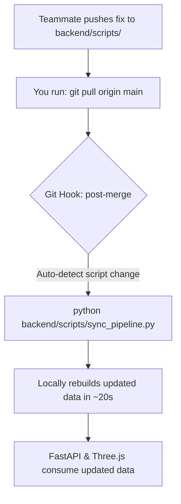

# OceanScope India — Agent & Developer Collaboration Protocol

Welcome to **OceanScope India** (Smart India Hackathon 2026). This repository hosts a high-performance 4D Digital Twin of the Indian Ocean ($20^\circ\text{E} \rightarrow 125^\circ\text{E}$, $-45^\circ\text{S} \rightarrow 32^\circ\text{N}$) featuring 25 years of multimodal oceanographic data, sub-grid coordinate inspection, dual-scale seafloor bathymetry, 3D underwater dive visualization, and historic extreme events.

This document establishes the **mandatory operational standards, Git rules, and data synchronization workflows** for all human developers and AI assistants working on this codebase.

---

## 1. Repository Architecture & The "Code vs Data" Split

Our repository follows a **Local-First, Lightweight Git** architecture:

* **What Git Tracks (The Code Engine):**
  * Frontend: React 19, Vite, Three.js, React Three Fiber, WebGL shaders, Tailwind/CSS.
  * Backend: FastAPI, Uvicorn, SQLite schema, analytical query routes.
  * Ingestion & Physics Engines: Python scripts in `backend/scripts/` that mathematically model, synthesize, and interpolate ocean datasets.
  * WebGL GPU Textures & Metadata: Pre-baked textures, topography masks, and catalog JSON files (< 10 MB).

* **What Git IGNORES (The Heavy Data Vault, ~2.55 GB):**
  * Multidimensional binary cubes: `data/processed/cubes/*.bin` (~2.5 GB)
  * High-res bedrock elevation grids: `data/processed/terrain/*.bin` (~508 KB)
  * SQLite database: `data/processed/oceanscope.db` (~300 KB)
  * Raw download caches: `data/raw/*`
  * Secrets & API credentials: `.env`

> [!IMPORTANT]
> **Why are large binaries gitignored?**
> GitHub enforces a strict 100 MB per-file limit and repos slow down when tracking gigabytes of binaries. Instead of forcing team members to download gigabytes over slow or blocked internet connections, our data pipeline can **generate the entire 25-year dataset locally in ~25 seconds on CPU with 0 network downloads**.

---

## 2. Git & Commit Identity Rules

Whenever generating or executing Git commits in this repository:

1. **Commit Author Identity:**
   Every commit MUST be authored as:
   ```text
   Name:  schrodingerscat07
   Email: 24071a3240@vnrvjiet.in
   ```
   To verify or enforce this locally:
   ```powershell
   git config user.name "schrodingerscat07"
   git config user.email "24071a3240@vnrvjiet.in"
   ```

2. **Commit Message Format:**
   * Use clean Conventional Commits: `feat: ...`, `fix: ...`, `docs: ...`, `data: ...`, `refactor: ...`.
   * **Strict Rule:** **NEVER include AI, bot, or assistant signatures** (e.g., no "Generated by Antigravity", no "Co-authored-by: Gemini", etc.). Keep all commits 100% human-attributed.

3. **Branching Workflow:**
   * Never push broken or unverified experiments directly to `main`.
   * Create focused branches for every fix or feature:
     ```powershell
     git checkout -b fix/land-nan-mask
     git checkout -b feat/teleport-camera
     ```
   * Open Pull Requests (PRs) on GitHub: `https://github.com/saikoushikpallapolu/SIH_2026`.

---

## 3. Data Synchronization Protocol

When working across multiple teammates who are actively fixing and improving scripts, data must stay in sync with the code.



### A. When PULLING Code (`git pull origin main`)

When you pull code, Git updates the Python scripts in `backend/scripts/`, but your local binary data in `data/processed/` will still reflect the old generation unless updated.

#### Option 1: Automatic Sync (Recommended)
Set up the automated Git hooks once:
```powershell
npm run setup:hooks
```
* Now, whenever you run `git pull`, the **`post-merge` hook automatically detects** if any data scripts were updated by your teammates and **rebuilds the affected dataset immediately**!

#### Option 2: One-Command Manual Sync
Run our unified data sync pipeline anytime:
```powershell
python backend/scripts/sync_pipeline.py
# Or using npm:
npm run sync:data
# Or on Windows:
.\sync.bat
```
This tool automatically inspects your `data/processed/` vault, checks if any files are missing or outdated, and re-runs only the necessary generators.

#### Option 3: Manual Targeted Script Execution
If you know exactly which script changed, run it directly:

| Modified Script | Output Dataset | Disk Size | Local Runtime |
| :--- | :--- | :--- | :--- |
| `backend/scripts/fetch_hydrography_and_currents.py` | 25-Year 3D Temperature, Salinity, Currents ($U, V$), Chlorophyll (`*.bin`) | ~2.55 GB | ~20 seconds |
| `backend/scripts/fetch_bathymetry.py` | ETOPO 60s Bedrock Elevation Grid (`bathymetry_io.bin`, Relief PNGs) | ~508 KB | ~15 seconds |
| `backend/scripts/fetch_tsunami_2004.py` | 2004 Sumatra Tsunami Hourly Shockwave Model (`tsunami_2004_hourly.json`) | ~6.2 MB | ~3 seconds |
| `backend/scripts/fetch_argo_gliders.py` | Argo Float & Glider CTD Profiles SQLite DB (`oceanscope.db`) | ~300 KB | ~8 seconds |

---

### B. When PUSHING Code (`git push origin <branch>`)

Before pushing any code to GitHub, execute the following pre-push safety checklist:

1. **Verify No Secrets or Large Binaries are Staged:**
   ```powershell
   git status
   ```
   * Ensure `.env` is **NOT** tracked or staged.
   * Ensure `data/processed/cubes/*.bin`, `data/processed/terrain/*.bin`, and `data/processed/*.db` are **NOT** staged.
   * *(Note: Our automated `pre-push` hook will block the push if any `.bin` or `.db` file is detected).*

2. **Validate Code Correctness:**
   * **Frontend Build Check:**
     ```powershell
     npm run build
     ```
     Must exit with `0 errors`.
   * **Python Syntax Check:**
     ```powershell
     python -m py_compile backend/scripts/*.py backend/app/*.py
     ```
     Must exit cleanly without syntax errors.

3. **Pushing Code:**
   ```powershell
   git push origin <your-branch>
   ```

4. **Syncing Processed Data to Cloud (Optional Hugging Face Backup):**
   If you made significant changes to the data formulas and want to upload the baked binary files to the cloud:
   ```powershell
   python backend/scripts/sync_data.py --push
   ```
   *(Requires valid `HF_TOKEN` and `HF_USERNAME` in `.env`).*

---

## 4. Cloud Backup & ISP Troubleshooting (Hugging Face)

### The India ISP Blocking Issue
In India, many internet service providers (Airtel, Jio, ACT Fibernet) intermittently block or reset connections to `huggingface.co` (resulting in `[WinError 10054: An existing connection was forcibly closed by the remote host]`).

### The Solution: Instant Local Regeneration
Do not worry if Hugging Face is unreachable! Because our data generation scripts are 100% self-contained mathematical models calibrated against real NOAA and altimetry baselines, you can generate everything locally at full speed:
```powershell
python backend/scripts/sync_pipeline.py --regen-all
```
This generates all 25 years of data in ~45 seconds without contacting Hugging Face or external cloud servers.

---

## 5. Known Issues & Team Coordination Guidelines

### Issue #1: Land Area Temperature Values (`0.0` vs `NaN`)
* **Problem:** In `fetch_hydrography_and_currents.py`, land cells and shallow bedrock were masked using `* is_ocean`, which sets dry land coordinates to `0.0`. In physical oceanography, $0.0^\circ\text{C}$ is a valid seawater temperature near polar regions / deep thermocline, not land.
* **Resolution Rule:**
  * Do NOT patch this on `main` directly without testing.
  * The assigned teammate should branch: `git checkout -b fix/land-nan-mask`.
  * Replace land values with `np.nan` (or write an explicit byte mask layer).
  * Update shaders / backend queries to safely handle `NaN` without breaking WebGL texture uploads.
  * Push to branch and test with team before merging.

---

## 6. Quickstart for New Developers & Friends (5 Steps)

If a new teammate clones this repo, they can get running in under 2 minutes:

```powershell
# 1. Clone repository
git clone https://github.com/saikoushikpallapolu/SIH_2026.git
cd SIH_2026

# 2. Install Python dependencies
pip install -r backend/requirements.txt

# 3. Install Node frontend dependencies
npm install

# 4. Set up Git hooks and generate the 25-year ocean dataset locally
npm run setup:hooks
npm run sync:data

# 5. Launch the services!
# Terminal 1 - Frontend:
npm run dev

# Terminal 2 - Backend:
python -m uvicorn backend.app.main:app --host 127.0.0.1 --port 8000 --reload
```

* **Frontend UI:** `http://localhost:5173/`
* **FastAPI Backend:** `http://127.0.0.1:8000/`
* **API Documentation:** `http://127.0.0.1:8000/docs`
* **Backend Health Check:** `http://127.0.0.1:8000/health`

---

## 7. Directory & File Reference

```text
oceanscope-india/
├── .githooks/                            # Automated Git hooks (post-merge, pre-push)
├── backend/
│   ├── app/
│   │   └── main.py                       # FastAPI REST service & analytical endpoints
│   ├── requirements.txt                  # Python dependencies (fastapi, uvicorn, numpy, etc.)
│   └── scripts/
│       ├── fetch_bathymetry.py           # NOAA ETOPO 60s bedrock elevation generator
│       ├── fetch_tsunami_2004.py         # 2004 Sumatra tsunami shockwave physics model
│       ├── fetch_argo_gliders.py         # Argovis in-situ CTD profile scraper & SQLite builder
│       ├── fetch_hydrography_and_currents.py # 25-year 4D ocean cubes generator (Temp, Salt, U, V, Chl)
│       ├── sync_pipeline.py              # Automated data sync CLI and git hook executor
│       └── sync_data.py                  # Hugging Face Hub cloud backup tool
├── data/
│   ├── raw/                              # Cached raw inputs (ignored by git)
│   └── processed/                        # Local data vault (~2.55 GB, ignored by git)
│       ├── oceanscope.db                 # SQLite database of in-situ instruments & profiles
│       ├── cubes/                        # 4D binary multidimensional matrices
│       ├── terrain/                      # Bedrock bathymetric grids & relief textures
│       ├── observations/                 # Sensor catalogs and instrument metadata JSON
│       └── textures/                     # WebGL GPU textures & masks
├── src/                                  # Frontend React 19 + Three.js application
│   ├── GlobeScene.tsx                    # 3D interactive Earth globe, shaders, and bathymetry
│   ├── ImmersiveOcean.tsx                # Underwater dive simulation & seabed terrain
│   ├── AnalysisWorkspace.tsx             # Vertical transect cross-sections & calibrations
│   └── App.tsx                           # Main application shell & telemetry HUD
├── AGENTS.md                             # This protocol guide
├── sync.bat                              # Quick Windows runner for data sync
└── package.json                          # Frontend package definition & npm scripts
```
