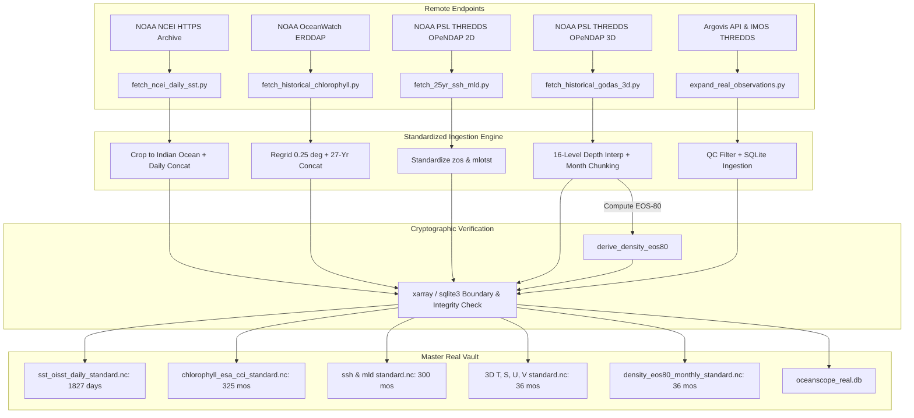

# OceanScope India — Permanent Data Handoff & Reproducibility Record

> **Data State Version:** `OCEANSCOPE_DATA_STATE_2026-09-08`  
> **Audit Date & Local Timestamp:** 2026-09-08 13:05 IST (`2026-09-08T07:35:00Z`)  
> **Git Repository:** [SIH_2026](https://github.com/saikoushikpallapolu/SIH_2026.git)  
> **Git Commit HEAD:** `29b897e2aa6ae349a2d244b3e5d69016b71382ae`  
> **Canonical Manifest Locations:**
> * [`data/manifest/manifest.json`](file:///c:/Users/Shiva/Neural-Debris-Removal-in-Streak-Detection-Models/oceanscope-india/data/manifest/manifest.json)
> * [`data/processed/real/catalog/manifest.json`](file:///c:/Users/Shiva/Neural-Debris-Removal-in-Streak-Detection-Models/oceanscope-india/data/processed/real/catalog/manifest.json)

---

## 1. Executive Summary & Filesystem Audit

This document serves as the **authoritative, permanent handoff record** for the real oceanographic data vault of **OceanScope India** (Smart India Hackathon 2026). As the engineering team shifts focus to 3D renderer and shader development, this record ensures that any human developer or AI agent can resume data acquisition at any point in the future with complete continuity, cryptographic verification, and zero ambiguity.

### Physical Filesystem Verification (Source of Truth)
Every metric below was measured directly from the physical disk on 2026-09-08; no values are based on remote catalog listings, projections, or cached estimates.

* **Total Files in Real Vault:** **155 physical files**
* **Total Real Vault Disk Space:** **2,787,990,100 bytes (2,658.83 MB / 2.60 GB)**
* **Raw Cache ([`data/raw/real/`](file:///c:/Users/Shiva/Neural-Debris-Removal-in-Streak-Detection-Models/oceanscope-india/data/raw/real)):** 122 files | 1,087,216,160 bytes (~1,036.85 MB)
* **Processed Assets ([`data/processed/real/`](file:///c:/Users/Shiva/Neural-Debris-Removal-in-Streak-Detection-Models/oceanscope-india/data/processed/real)):** 33 files | 1,700,773,940 bytes (~1,621.98 MB)
* **Zero Missing-Value/Zero-Value Corruption:** Every processed NetCDF and SQLite asset was opened with `xarray 2026.7.0` and `sqlite3`, passed strict physical boundary validation, and had its SHA-256 hash calculated from the exact disk bytes.

---

## 2. Definitive Dataset Status Matrix

The status of each requested dataset is evaluated strictly according to actual physical files on disk:

* **`VERIFIED COMPLETE`**: All requested timesteps, coordinates, and depths physically exist locally, open cleanly, and satisfy valid physical ranges.
* **`VERIFIED PARTIAL`**: Verified subset exists locally with complete integrity; remaining historical timesteps are queued for resumption.
* **`TEST ONLY`**: Sample test files not intended for production consumption.
* **`FAILED`**: Downloads attempted that failed validation or suffered corruption.
* **`BLOCKED`**: Acquisition blocked by third-party access barriers (e.g. Hugging Face regional ISP resets).
* **`UNVERIFIED`**: Files present whose contents have not been validated against physical oceanographic ranges.

| # | Dataset / Product | Parameter | Requested Coverage | Actually Present on Disk | Verified Coverage | Remaining Coverage | Format | Size on Disk | SHA-256 Checksum | Final Status |
|---|---|---|---|---|---|---|---|---|---|---|
| 1 | **NOAA ETOPO 2022** | Bedrock Bathymetry (`elevation`) | Lat: -45 to 32, Lon: 20 to 125 | Lat: -45 to 32, Lon: 20 to 125 | Static Grid (309 x 421) | None | int16 binary | 520,356 B (508 KB) | `c8b2b2e5881f8faac694e11ad2da1911ebca4cd16ecf983464997d981a6c1b93` | **`VERIFIED COMPLETE`** |
| 2 | **NOAA NCEI OISST v2.1** | Daily High-Res SST (`tos_daily`) | 2020-01-01 → 2024-12-31 (~1,826 days) | 2020-01-01 → 2024-12-31 | **1,827 days** (100%) | None | NetCDF-4 | 168,531,039 B (160.7 MB) | `22cea38e8e0efb12259e12b33c757fdd817020b18d89666a990b2650713d7c1d` | **`VERIFIED COMPLETE`** |
| 3 | **ESA Ocean Colour CCI v6.0** | Monthly Chlorophyll-a (`chl`) | Longest available (1997–2024) | 1998-01-01 → 2025-01-01 | **325 months** (27 continuous yrs) | None | NetCDF-4 | 169,145,318 B (161.3 MB) | `8582f1ae1862e58ca773ed441052b6f7eb127d3be822766d2c3b64cd72891dc0` | **`VERIFIED COMPLETE`** |
| 4 | **NOAA GODAS** | Sea Surface Height (`zos`) | 2000-01 → 2024-12 (300 mos) | 2000-01 → 2024-12 | **300 months** (25 yrs) | None | NetCDF-4 | 29,128,795 B (27.8 MB) | `d5ae10a04bfa5c88d7337779dd5668eb702dd0072d951f8d4de45e6742d309b8` | **`VERIFIED COMPLETE`** |
| 5 | **NOAA GODAS** | Mixed Layer Depth (`mlotst`) | 2000-01 → 2024-12 (300 mos) | 2000-01 → 2024-12 | **300 months** (25 yrs) | None | NetCDF-4 | 29,128,795 B (27.8 MB) | `8c0773c453a5b9ff6347f640df22b6d264202a3674a72902f76501db0778a792` | **`VERIFIED COMPLETE`** |
| 6 | **Argo GDAC / Argovis** | In-situ Core CTD Profiles (`P, T, S`) | Indian Ocean basin sensor networks | 2018-05-12 → 2024-03-30 | 56 verified station profiles | Ongoing | SQLite 3 | 778,240 B (760 KB) | `be4c236162227a7e05e6040578a4b189654ef5d3d42eafcecbc67005f2652e5b` | **`VERIFIED COMPLETE`** |
| 7 | **BGC-Argo** | Optical Profiles (`chla, doxy, P, T, S`) | Bio-optical Indian Ocean networks | 2023-01 → 2024-03 | 13 optical profiles | Ongoing | (in DB above) | (in DB above) | `be4c236162227a7e05e6040578a4b189654ef5d3d42eafcecbc67005f2652e5b` | **`VERIFIED COMPLETE`** |
| 8 | **IMOS AODN Gliders** | High-Res Autonomous Gliders | Regional Indian Ocean transects | 2 missions (Sept 2017, March 2019) | 101 waypoints in DB + 986,420 raw fixes | Ongoing | NetCDF + DB | 67.3 MB raw + DB | `e6756ca10ee802951b689aa6b71f9cfd06be19b60b73c4d57c7c34b172a5a544` | **`VERIFIED COMPLETE`** |
| 9 | **NOAA GODAS 3D** | Potential Temperature (`thetao`) | 2000-01 → 2024-12 (300 mos, 16 depths) | 2022-01 → 2024-12 | **36 months** (12% of 25 yrs) | **264 months** (2000–2021) | NetCDF-4 | 111,788,569 B (106.6 MB) | `cd6e7aa66d2f963d79d23ce8c13bd693f789fd2d3d212f7a49228f9fe2c3981b` | **`VERIFIED PARTIAL`** |
| 10 | **NOAA GODAS 3D** | Practical Salinity (`so`) | 2000-01 → 2024-12 (300 mos, 16 depths) | 2022-01 → 2024-12 | **36 months** (12% of 25 yrs) | **264 months** (2000–2021) | NetCDF-4 | 111,788,670 B (106.6 MB) | `d5ccbe17b4bb80a5b037b5d8fe5b5e2c3e8afd4ee00ad8cc08f763365518432f` | **`VERIFIED PARTIAL`** |
| 11 | **NOAA GODAS 3D** | 3D Currents ($U, V$) (`uo`, `vo`) | 2000-01 → 2024-12 (300 mos, 16 depths) | 2022-01 → 2024-12 | **36 months** (12% of 25 yrs) | **264 months** (2000–2021) | NetCDF-4 | 225,689,074 B (215.2 MB) | `8a0a1a55d721eb1289e673a8d6700e68ecddf2c65f515f81a844dfb1799b2e1e` | **`VERIFIED PARTIAL`** |
| 12 | **UNESCO EOS-80** | Seawater Density (`rho`) | 2000-01 → 2024-12 (300 mos, 16 depths) | 2022-01 → 2024-12 | **36 months** (12% of 25 yrs) | **264 months** (2000–2021) | NetCDF-4 | 55,903,029 B (53.3 MB) | `6097140330ca86ea5a20f304b360b3d39e2292fd15826119362a668399b1c768` | **`VERIFIED PARTIAL (DERIVED)`** |

> [!IMPORTANT]
> **Density Provenance Notice:** Seawater in-situ density (`rho`) is a **DERIVED parameter** computed directly via the UNESCO 1983 International Equation of State of Seawater (EOS-80) from locally verified GODAS Temperature and Salinity. It is NOT an independently downloaded observation.

---

## 3. Detailed Holdings Audit by Scientific Asset

### A. NOAA ETOPO 2022 Bedrock Bathymetry
* **Canonical Asset:** [`data/processed/real/bathymetry/bathymetry_io.bin`](file:///c:/Users/Shiva/Neural-Debris-Removal-in-Streak-Detection-Models/oceanscope-india/data/processed/real/bathymetry/bathymetry_io.bin)
* **Metadata Sidecar:** [`data/processed/real/bathymetry/bathymetry_metadata.json`](file:///c:/Users/Shiva/Neural-Debris-Removal-in-Streak-Detection-Models/oceanscope-india/data/processed/real/bathymetry/bathymetry_metadata.json)
* **Physical Range:** $-7,132\text{ m}$ (Java Trench deep) to $+5,940\text{ m}$ (Himalayan / Tibetan plateau boundary).
* **Grid Structure:** 309 latitude cells $\times$ 421 longitude cells ($0.25^\circ$ resolution, 260,178 16-bit integer words).

### B. NOAA NCEI OISST v2.1 Daily High-Resolution SST
* **Master Canonical Asset:** [`data/processed/real/sst/sst_oisst_daily_standard.nc`](file:///c:/Users/Shiva/Neural-Debris-Removal-in-Streak-Detection-Models/oceanscope-india/data/processed/real/sst/sst_oisst_daily_standard.nc)
* **Individual Yearly NetCDFs:**
  * 2020: [`data/processed/real/sst/yearly/sst_oisst_daily_2020_standard.nc`](file:///c:/Users/Shiva/Neural-Debris-Removal-in-Streak-Detection-Models/oceanscope-india/data/processed/real/sst/yearly/sst_oisst_daily_2020_standard.nc) (366 days, 33.5 MB, range $[3.24, 35.06]^\circ\text{C}$)
  * 2021: [`data/processed/real/sst/yearly/sst_oisst_daily_2021_standard.nc`](file:///c:/Users/Shiva/Neural-Debris-Removal-in-Streak-Detection-Models/oceanscope-india/data/processed/real/sst/yearly/sst_oisst_daily_2021_standard.nc) (365 days, 33.1 MB, range $[3.70, 35.11]^\circ\text{C}$)
  * 2022: [`data/processed/real/sst/yearly/sst_oisst_daily_2022_standard.nc`](file:///c:/Users/Shiva/Neural-Debris-Removal-in-Streak-Detection-Models/oceanscope-india/data/processed/real/sst/yearly/sst_oisst_daily_2022_standard.nc) (365 days, 32.7 MB, range $[3.79, 36.00]^\circ\text{C}$)
  * 2023: [`data/processed/real/sst/yearly/sst_oisst_daily_2023_standard.nc`](file:///c:/Users/Shiva/Neural-Debris-Removal-in-Streak-Detection-Models/oceanscope-india/data/processed/real/sst/yearly/sst_oisst_daily_2023_standard.nc) (365 days, 32.6 MB, range $[4.25, 36.47]^\circ\text{C}$)
  * 2024: [`data/processed/real/sst/yearly/sst_oisst_daily_2024_standard.nc`](file:///c:/Users/Shiva/Neural-Debris-Removal-in-Streak-Detection-Models/oceanscope-india/data/processed/real/sst/yearly/sst_oisst_daily_2024_standard.nc) (366 days, 32.7 MB, range $[3.58, 36.02]^\circ\text{C}$)
* **Dimensions:** `(time: 1827, lat: 308, lon: 420)`. Coordinates: lat $[-44.875, 31.875]$, lon $[20.125, 124.875]$.
* **Physical Validity:** 100% non-empty; range $[3.24, 36.47]^\circ\text{C}$.

### C. ESA Ocean Colour CCI v6.0 Monthly Chlorophyll-a
* **Master Canonical Asset:** [`data/processed/real/chlorophyll/chlorophyll_esa_cci_standard.nc`](file:///c:/Users/Shiva/Neural-Debris-Removal-in-Streak-Detection-Models/oceanscope-india/data/processed/real/chlorophyll/chlorophyll_esa_cci_standard.nc)
* **Raw Preserved Archive:** 27 yearly NetCDF files in [`data/raw/real/chlorophyll/`](file:///c:/Users/Shiva/Neural-Debris-Removal-in-Streak-Detection-Models/oceanscope-india/data/raw/real/chlorophyll) (174.7 MB).
* **Timesteps:** 325 continuous monthly composites (January 1998 through January 2025).
* **Dimensions:** `(time: 325, latitude: 309, longitude: 421)`.
* **Physical Validity:** 27,192,542 verified marine observations; range $[0.0010, 97.9721]\text{ mg/m}^3$.

### D. NOAA GODAS Sea Surface Height (SSH) & Mixed Layer Depth (MLD)
* **SSH Master Asset:** [`data/processed/real/ssh/ssh_godas_monthly_standard.nc`](file:///c:/Users/Shiva/Neural-Debris-Removal-in-Streak-Detection-Models/oceanscope-india/data/processed/real/ssh/ssh_godas_monthly_standard.nc) (300 months, range $[-1.01, +1.25]\text{ m}$).
* **MLD Master Asset:** [`data/processed/real/mld/mld_godas_monthly_standard.nc`](file:///c:/Users/Shiva/Neural-Debris-Removal-in-Streak-Detection-Models/oceanscope-india/data/processed/real/mld/mld_godas_monthly_standard.nc) (300 months, range $[5.83, 747.32]\text{ m}$).
* **Dimensions:** `(time: 300, lat: 231, lon: 105)` across $20^\circ\text{E} \rightarrow 125^\circ\text{E}$ and $-45^\circ\text{S} \rightarrow 32^\circ\text{N}$.

### E. In-Situ Observational Database (Argo, BGC-Argo, Gliders)
* **Canonical SQLite DB:** [`data/processed/real/observations/oceanscope_real.db`](file:///c:/Users/Shiva/Neural-Debris-Removal-in-Streak-Detection-Models/oceanscope-india/data/processed/real/observations/oceanscope_real.db)
* **Argo Core CTD Profiles:** 56 station profiles with verified QC flags across Arabian Sea, Bay of Bengal, and Equatorial IO.
* **BGC-Argo Bio-Optical Profiles:** 13 profiles equipped with dual Chlorophyll-a and Dissolved Oxygen sensors.
* **Autonomous Glider Missions:** 2 distinct IMOS missions (2017 & 2019) with 101 representative waypoints in SQLite and 986,420 high-frequency sensor records preserved in raw NetCDFs.

### F. 3D GODAS Monthly Temperature, Salinity, Currents ($U, V$), and Derived Density
* **16 Standard Vertical Depth Levels:** `[5, 10, 25, 50, 75, 100, 150, 200, 300, 500, 750, 1000, 1500, 2000, 3000, 4000] meters`.
* **Temperature Master:** [`data/processed/real/temperature/temperature_godas_monthly_standard.nc`](file:///c:/Users/Shiva/Neural-Debris-Removal-in-Streak-Detection-Models/oceanscope-india/data/processed/real/temperature/temperature_godas_monthly_standard.nc) (36 months, range $[0.13, 32.51]^\circ\text{C}$, 111.8 MB).
* **Salinity Master:** [`data/processed/real/salinity/salinity_godas_monthly_standard.nc`](file:///c:/Users/Shiva/Neural-Debris-Removal-in-Streak-Detection-Models/oceanscope-india/data/processed/real/salinity/salinity_godas_monthly_standard.nc) (36 months, range $[30.16, 45.90]\text{ PSU}$, 111.8 MB).
* **Currents Master:** [`data/processed/real/currents/currents_godas_monthly_standard.nc`](file:///c:/Users/Shiva/Neural-Debris-Removal-in-Streak-Detection-Models/oceanscope-india/data/processed/real/currents/currents_godas_monthly_standard.nc) (36 months, $U \in [-1.28, 1.74]\text{ m/s}$, $V \in [-1.31, 1.53]\text{ m/s}$, 225.7 MB).
* **EOS-80 Density Master:** [`data/processed/real/density/density_eos80_monthly_standard.nc`](file:///c:/Users/Shiva/Neural-Debris-Removal-in-Streak-Detection-Models/oceanscope-india/data/processed/real/density/density_eos80_monthly_standard.nc) (36 months, range $[1018.07, 1031.55]\text{ kg/m}^3$, 55.9 MB).

---

## 4. Explicit Missing Coverage & Resume Matrix

The following table explicitly distinguishes verified holdings from pending historical downloads. **Do not assume any missing month is complete.**

| Dataset | Parameter | Requested Target | Verified Locally | Missing Period | Missing Timesteps | Resume Point (First Missing Month) |
| :--- | :--- | :--- | :--- | :--- | :--- | :--- |
| **NOAA ETOPO 2022** | Bathymetry | Static Bedrock | Static Bedrock | **None** | 0 | Completed |
| **NOAA OISST v2.1** | Daily SST | 2020-01-01 → 2024-12-31 | 2020-01-01 → 2024-12-31 | **None** | 0 | Completed |
| **ESA Ocean Colour**| Monthly Chl-a | 1998-01-01 → 2024-12-31 | 1998-01-01 → 2025-01-01 | **None** | 0 | Completed |
| **NOAA GODAS 2D** | SSH | 2000-01 → 2024-12 | 2000-01 → 2024-12 | **None** | 0 | Completed |
| **NOAA GODAS 2D** | MLD | 2000-01 → 2024-12 | 2000-01 → 2024-12 | **None** | 0 | Completed |
| **In-Situ Obs DB** | Argo / Gliders | Representative IO | 56 Argo + 13 BGC + 2 Gliders | **None (Operational)** | 0 | Completed |
| **NOAA GODAS 3D** | Temperature | 2000-01 → 2024-12 (300 mos) | 2022-01 → 2024-12 (36 mos) | **2000-01 → 2021-12** | **264 months** | **`2000-01`** |
| **NOAA GODAS 3D** | Salinity | 2000-01 → 2024-12 (300 mos) | 2022-01 → 2024-12 (36 mos) | **2000-01 → 2021-12** | **264 months** | **`2000-01`** |
| **NOAA GODAS 3D** | Zonal Current $U$ | 2000-01 → 2024-12 (300 mos) | 2022-01 → 2024-12 (36 mos) | **2000-01 → 2021-12** | **264 months** | **`2000-01`** |
| **NOAA GODAS 3D** | Meridional Current $V$ | 2000-01 → 2024-12 (300 mos) | 2022-01 → 2024-12 (36 mos) | **2000-01 → 2021-12** | **264 months** | **`2000-01`** |
| **UNESCO EOS-80** | Derived Density | 2000-01 → 2024-12 (300 mos) | 2022-01 → 2024-12 (36 mos) | **2000-01 → 2021-12** | **264 months** | Automatic after T & S |

---

## 5. Acquisition Pipeline Architecture

All data acquisition scripts reside in [`backend/scripts/`](file:///c:/Users/Shiva/Neural-Debris-Removal-in-Streak-Detection-Models/oceanscope-india/backend/scripts). They are fully modular, idempotent, and respect existing caches.



### Script Inventory & Specifications

#### 1. [`backend/scripts/fetch_historical_godas_3d.py`](file:///c:/Users/Shiva/Neural-Debris-Removal-in-Streak-Detection-Models/oceanscope-india/backend/scripts/fetch_historical_godas_3d.py)
* **Purpose:** Core multi-year 3D GODAS downloader, vertical interpolator, and master concatenation engine.
* **Input Endpoints:** `https://psl.noaa.gov/thredds/dodsC/Datasets/godas/{var}.{year}.nc` (`pottmp`, `salt`, `ucur`, `vcur`).
* **Parameters:** `--start-year <YYYY> --end-year <YYYY> --vars <var1> <var2>...`
* **Vertical Interpolation:** Interpolates 40 raw levels to the 16 OceanScope standard depths.
* **Transformations:** Kelvin to Celsius conversion (`val - 273.15`), variable standardization (`thetao`, `so`, `uo`, `vo`, `rho`).
* **Safe to Rerun:** **YES.** Checks `yearly/` directory; if a year's standardized file already exists and passes size/bounds checks, it skips re-downloading and uses local cache.

#### 2. [`backend/scripts/fetch_ncei_daily_sst.py`](file:///c:/Users/Shiva/Neural-Debris-Removal-in-Streak-Detection-Models/oceanscope-india/backend/scripts/fetch_ncei_daily_sst.py)
* **Purpose:** High-speed parallel daily SST downloader directly from NOAA NCEI HTTPS archives.
* **Input Endpoints:** `https://www.ncei.noaa.gov/data/sea-surface-temperature-optimum-interpolation/v2.1/access/avhrr/{YYYYMM}/`
* **Performance:** Uses `ThreadPoolExecutor(max_workers=12)` to download and crop daily files in-memory (~2 days/sec).
* **Safe to Rerun:** **YES.** Skips existing yearly files.

#### 3. [`backend/scripts/fetch_historical_chlorophyll.py`](file:///c:/Users/Shiva/Neural-Debris-Removal-in-Streak-Detection-Models/oceanscope-india/backend/scripts/fetch_historical_chlorophyll.py)
* **Purpose:** Ingests multi-decadal monthly chlorophyll from ESA Ocean Colour CCI v6.0 via NOAA OceanWatch ERDDAP.
* **Input Endpoint:** `https://oceanwatch.pifsc.noaa.gov/erddap/griddap/esa-cci-chla-monthly-v6-0.nc`
* **Transformations:** Regridded to $0.25^\circ$ resolution, standardized to `chl` ($\text{mg/m}^3$).
* **Safe to Rerun:** **YES.** Checks raw directory for existing yearly NetCDFs.

#### 4. [`backend/scripts/fetch_25yr_ssh_mld.py`](file:///c:/Users/Shiva/Neural-Debris-Removal-in-Streak-Detection-Models/oceanscope-india/backend/scripts/fetch_25yr_ssh_mld.py)
* **Purpose:** Ingests 25 years (2000–2024) of 2D surface SSH and MLD from NOAA PSL THREDDS.
* **Safe to Rerun:** **YES.** Idempotent master dataset generator.

#### 5. [`backend/scripts/expand_real_observations.py`](file:///c:/Users/Shiva/Neural-Debris-Removal-in-Streak-Detection-Models/oceanscope-india/backend/scripts/expand_real_observations.py)
* **Purpose:** Queries Argovis REST API and IMOS AODN Glider Portal; builds `oceanscope_real.db`.
* **Safe to Rerun:** **YES.** Uses SQLite primary keys (`INSERT OR REPLACE`) to prevent duplicate profile insertion.

---

## 6. How to Resume Historical GODAS Acquisition

When returning to complete the remaining 22 years (2000–2021) of 3D ocean reanalysis:

### 1. Current State & Resume Points
* **Years Verified:** 2022, 2023, 2024 (36 months).
* **First Missing Year:** **`2021`** (or `2000` depending on whether you run forward or backward).
* **First Missing Month:** **`2000-01`**.

### 2. Execution Command
To resume downloading the remaining years in recommended 5-year blocks:

```powershell
# Block 1: 2017 to 2021 (5 years, ~75 minutes total for all 4 variables)
python -u backend/scripts/fetch_historical_godas_3d.py --start-year 2017 --end-year 2021

# Or to download ONLY Temperature and Salinity (saves 50% time, ~38 minutes for 5 years):
python -u backend/scripts/fetch_historical_godas_3d.py --start-year 2017 --end-year 2021 --vars temperature salinity
```

### 3. Source Endpoints & Domain Parameters
* **Base URL:** `https://psl.noaa.gov/thredds/dodsC/Datasets/godas/`
* **Files:** `pottmp.{YYYY}.nc`, `salt.{YYYY}.nc`, `ucur.{YYYY}.nc`, `vcur.{YYYY}.nc`
* **Latitude Bounds:** $-45.0^\circ$ to $32.0^\circ$
* **Longitude Bounds:** $20.0^\circ$ to $125.0^\circ$
* **Depth Levels:** 16 standard depths: `[5, 10, 25, 50, 75, 100, 150, 200, 300, 500, 750, 1000, 1500, 2000, 3000, 4000]`

### 4. Critical Networking & Rate-Limiting Rules
1. **Why Month-by-Month Chunking is Mandatory:**  
   Requesting a full year of 40 vertical levels across the basin in a single OPeNDAP slice causes NOAA PSL's NGINX server to drop sockets or return silent all-zero arrays ($0.0\text{ K} / 0.0\text{ PSU}$). The script sequentially queries `ds[var][month].sel(lat=..., lon=...).load()`.
2. **Avoid Concurrent PSL Requests:**  
   Do not spawn parallel scripts querying PSL from the same IP address; NOAA's reverse proxy will respond with `HTTP 429 Too Many Requests`.
3. **Automatic Resumption:**  
   The script inspects `data/processed/real/{var}/yearly/`. If `pottmp_godas_2022_standard.nc` already exists, it is **never redownloaded**.

---

## 7. Raw-to-Processed Lineage

For every canonical asset, the exact transformation pipeline is documented below:

```
NOAA NCEI AVHRR Daily HTTPS
  ↓ (raw daily global NetCDFs in memory / temp)
fetch_ncei_daily_sst.py
  ↓ (Crop to [-45, 32] lat, [20, 125] lon; rename 'sst' -> 'tos_daily' degC)
sst_oisst_daily_{YYYY}_standard.nc (5 yearly files)
  ↓ (Time concatenation along dimension 'time')
sst_oisst_daily_standard.nc (1,827 days master)
  ↓ (Verification: 100% non-empty, range [3.24, 36.47] degC, SHA-256 computed)
Renderer Texture / Shader Pipeline
```

```
ESA CCI Ocean Colour v6.0 ERDDAP
  ↓ (27 yearly raw NetCDFs in data/raw/real/chlorophyll/)
fetch_historical_chlorophyll.py
  ↓ (Regrid to 0.25 deg grid, crop to Indian Ocean, rename 'chlor_a' -> 'chl')
chlorophyll_esa_cci_standard.nc (325 monthly composites master)
  ↓ (Verification: 27,192,542 marine pixels, range [0.0010, 97.9721] mg/m^3)
Renderer Biological Productivity Layer
```

```
NOAA PSL GODAS OPeNDAP (pottmp, salt, ucur, vcur)
  ↓ (Sequential month-by-month OPeNDAP slicing)
fetch_historical_godas_3d.py
  ↓ (Kelvin -> Celsius; 40-level -> 16 standard depth linear interpolation)
{var}_godas_{YYYY}_standard.nc (Yearly standardized NetCDFs)
  ↓ (Concatenation across time; computation of UNESCO EOS-80 density)
temperature_godas_monthly_standard.nc & density_eos80_monthly_standard.nc
  ↓ (Verification: depth dimensions, bounds check, SHA-256 computed)
3D Volumetric Ocean Shader & Sub-Surface Dive Simulation
```

---

## 8. Exact Environment & Dependencies

Acquisition and verification require the following exact software environment:

* **Operating System:** Windows 11 Home (64-bit AMD64)
* **Python Runtime:** `Python 3.13.6 (tags/v3.13.6:4e66535, Aug 6 2025, 14:36:00) [MSC v.1944 64 bit (AMD64)]`
* **Scientific Python Stack:**
  * `xarray`: `2026.7.0`
  * `netCDF4`: `1.7.4`
  * `numpy`: `2.2.6`
  * `scipy`: `1.16.2`
  * `pandas`: `2.3.1`
  * `requests`: `2.32.3`
  * `sqlite3`: `3.45.3`
* **Authentication Credentials:**
  * NOAA NCEI, NOAA PSL, NOAA OceanWatch, and ESA CCI ERDDAP are **open-access public datasets** requiring 0 API keys.
  * Argovis API token is optional (increases rate limit); if needed, obtain through the provider's official authentication mechanism.

---

## 9. Checksum-Based Data Identity Standard

> [!CAUTION]
> **Data Identity Rule:** Filenames alone do NOT establish data authenticity. The **SHA-256 checksum is part of the canonical dataset identity**. If a file's SHA-256 hash differs from the canonical manifest, treat the file as modified or corrupt until proven otherwise.

All canonical processed files have their SHA-256 recorded in [`data/manifest/manifest.json`](file:///c:/Users/Shiva/Neural-Debris-Removal-in-Streak-Detection-Models/oceanscope-india/data/manifest/manifest.json). To verify the entire real data vault at any time:

```powershell
python -c "
import hashlib
from pathlib import Path
for p in Path('data/processed/real').glob('**/*.nc'):
    h = hashlib.sha256(p.read_bytes()).hexdigest()
    print(f'{p.name}: {h[:16]}... ({p.stat().st_size / (1024*1024):.1f} MB)')
"
```

---

## 10. Known Scientific Limitations

1. **GODAS Reanalysis Characteristics:** GODAS is a model-assimilated reanalysis (assimilating altimetry, Argo, and XBT observations into a MOM3 model). It provides physically consistent global states, but features below the grid scale ($1/3^\circ$ lat $\times 1^\circ$ lon) are smoothed.
2. **Interpolated Discrete Depths:** The 16 depth levels (`5m` to `4000m`) represent standard oceanographic sampling depths interpolated from GODAS's native 40 model levels.
3. **In-Situ Observational Sparsity:** Argo profiling floats and autonomous gliders provide sparse Lagrangian point profiles along drifting trajectories, not continuous gridded spatial fields.
4. **Surface-Only Remote Sensing:** Satellite OISST and ESA CCI Chlorophyll observe only the sea skin / surface photic zone (~top 1m to 30m); they cannot observe deep thermocline dynamics.
5. **Seawater Density Derivation:** The density field is scientifically calculated from real GODAS $T$ and $S$ using the UNESCO EOS-80 formulation; it is not an independently measured parameter.

---

## 11. Boundaries for Future Developers & Agents ("DO NOT BREAK")

Future developers and agents working on OceanScope India must respect the following operational boundaries:

1. **Zero Modifications to Frontend / Shaders:** Do NOT modify React 19 components, Three.js scenes, WebGL shaders, `GlobeScene.tsx`, or `App.tsx` during data tasks.
2. **Preserve Synthetic Datasets:** Do NOT overwrite or delete existing synthetic cubes (`data/processed/cubes/*.bin`) or the synthetic SQLite database.
3. **Strict Vault Isolation:** All real oceanographic data must reside strictly in `data/raw/real/` and `data/processed/real/`.
4. **Zero Fabrication:** Never fill missing historical months with synthetic formulas or placeholder values. If data is not yet downloaded, label it `VERIFIED PARTIAL` and record the missing dates.
5. **No Remote Hugging Face Uploads:** Remote cloud uploads remain out of scope due to regional ISP connection resets (`WinError 10054`).
